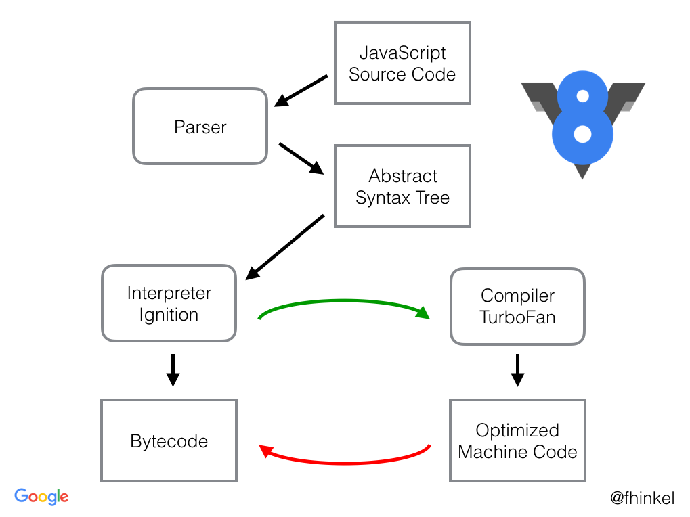
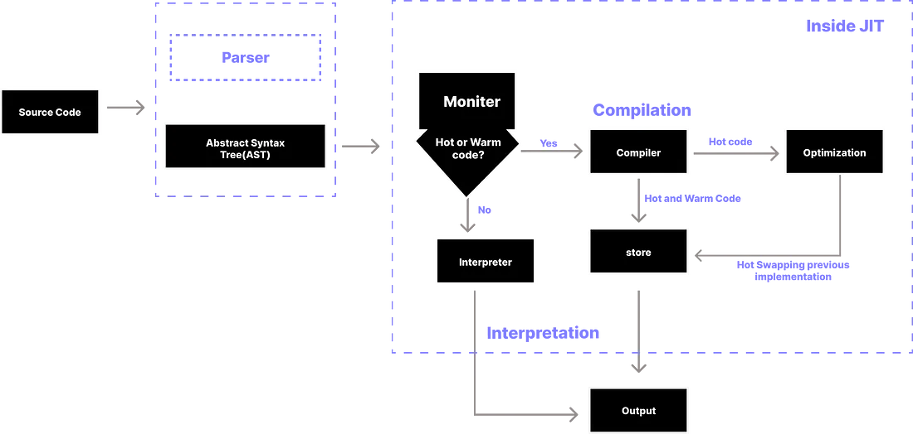

 > JS runtime environment is thought can be as a big container which has all the things to execute the JS code. Like JS Engine, APIs, event loop, callback queue, micro-task queue, etc.
 > Browser can only execute JS code because of the JS runtime environment it has, which is `V8` in case of chrome, Node.js, deno and `SpiderMonkey` in case of Firefox.
 
 - `setTimeout` in browser's and `Node.js` environment looks similar but under the hood they might be implemented differently.
 
 > Read about `ECMAScript`.
 

## JS Engine Architecture

- Steps of code execution
	- Parsing 
		- The code is broken down into tokens.
		- Syntax parser takes the code and convert it to AST(abstract syntax tree).
		
		- This AST is then passed to compilation stage.
		
	- Compilation
		- The compilation and execution goes hand in hand.
		- JS has JIT(Just-In-Time) compilation.
		- JS can be both interpreted language or compiled language.
		- When JS was created, it was interpreted language. The JS engine used interpreter to run the code. 
		- But now, most use both interpreter and compiler, it depends upon JS engine.
		- So, JIT uses both interpreter and compiler.
		- The AST goes to interpreter and it converts our high level code to byte code and the code move to the execution step. While it is doing so it takes help of the compiler to optimise the code.
		- In some JS Engine, we have AOT(ahead of time), in these case the compiler takes a piece of code which is going to be executed later and try to optimise it and also produces the byte code which then goes to execution phase.
		- Compilers also do some other optimisations like inlining, copy elision, inline caching, etc.
	- Execution
		- Requires memory heap and call stack.
		- Memory heap is in continuously in sync with call stack and garbage collector.
		- Garbage collector uses an algorithm known as `Mark and Sweep Algo`.

> Interpreter: It takes your code and executes it line by line. (fast)
> Compiler: In case of compiler, your whole code is compiler and a new code is formed which is the optimised version of the code which runs very fast and it has a lot of improvements.(efficiency)

### Google's V8 Engine Architecture

> V8 has interpreter called `Ignition` and optimising compiler called `TurboFan` and garbage collector `Orinoco` and `Oilpan`.

### Just In Time(JIT) compiler

- To get rid of the interpreter’s inefficiency, “the interpreter keeps retranslating the same code every time it goes through the loop”. 
- In the JIT compiler, we have a new component called a monitor (aka a profiler). That monitor watches the code as it runs and
- Identify the hot or warm components of the code eg: repetitive code.
- Transform those components into machine code during run time.
- Optimize the generated machine code.
- Hot swap the previous implementation of the code.

